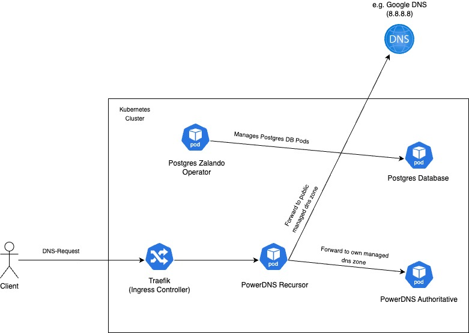

<a name="readme-top"></a>

[![Contributors][contributors-shield]][contributors-url]
[![Forks][forks-shield]][forks-url]
[![Stargazers][stars-shield]][stars-url]
[![Issues][issues-shield]][issues-url]
[![LinkedIn][linkedin-shield]][linkedin-url]


<!-- PROJECT LOGO -->
<br />
<div align="center">
  <a href="https://github.com/Tim-herbie/k8s_powerdns">
    
  </a>

  <h3 align="center">PowerDNS for Kubernetes</h3>

  <p align="center">
    This project aims to simplify the deployment of PowerDNS on Kubernetes.
    <br />
    <br />
    ·
    <a href="https://github.com/Tim-herbie/k8s_powerdns/issues/new?labels=bug&template=bug-report---.md">Report Bug</a>
    ·
    <a href="https://github.com/Tim-herbie/k8s_powerdns/issues/new?labels=enhancement&template=feature-request---.md">Request Feature</a>
  </p>
</div>


<!-- TABLE OF CONTENTS -->
<details>
  <summary>Table of Contents</summary>
  <ol>
    <li>
      <a href="#about-the-project">About The Project</a>
    </li>
    <li>
      <a href="#getting-started">Getting Started</a>
      <ul>
        <li><a href="#prerequisites">Prerequisites</a></li>
        <li><a href="#installation">Installation</a></li>
      </ul>
    </li>
    <li><a href="#usage">Usage</a></li>
    <li><a href="#contributing">Contributing</a></li>
    <li><a href="#contact">Contact</a></li>
    <li><a href="#projects">Projects</a></li>
  </ol>
</details>


<!-- ABOUT THE PROJECT -->
## About The Project
<p align="center">
  <a href="https://github.com/Tim-herbie/k8s_powerdns/blob/main/images/PowerDNS.jpg">
    
  </a>
</p>


This project provides a streamlined and efficient way to deploy a [PowerDNS](https://www.powerdns.com/) Authoritative and Recursor with an external Postgres Database within your Kubernetes environment.

Components:
* **[PowerDNS Authoritative Nameserver](https://doc.powerdns.com/authoritative/):** Handles DNS zone data.
* **[PowerDNS Recursor Server](https://doc.powerdns.com/recursor/):** Resolves DNS queries. 
* **HA Postgres Database:** Database of DNS zones and records (by [Postgres Zalando Operator](https://www.powerdns.com/))


<p align="right">(<a href="#readme-top">back to top</a>)</p>


<!-- GETTING STARTED -->
## Getting Started

The following requirements are necessary to install the project.

### System requirements for installation
- A running Kubernetes cluster
- kubectl installed and configured
- git installed and configured
- jq installed
- makefile installed

### Already installed within your Kubernetes Cluster
- [Ingresscontroller Traefik](https://doc.traefik.io/traefik/providers/kubernetes-ingress/)


### Installation

_The deployment is handled by a Makefile._

1. Clone the repo
    ```sh
   git clone https://github.com/Tim-herbie/k8s_powerdns.git
   ```
2.  Before you can deploy it, you have at least to adjust the variable **DOMAIN** in the Makefile. 
  
3. Install the Makefile
   ```sh
   make all
   ```

<p align="right">(<a href="#readme-top">back to top</a>)</p>


<!-- USAGE EXAMPLES -->
## Usage

### Webserver Access
Once the PowerDNS server is up and running, you can access the webserver with the following credentials:

- Username: pdns
- Password: your webserver-password (default value: **secret**)


<p align="right">(<a href="#readme-top">back to top</a>)</p>


<!-- CONTRIBUTING -->
## Contributing

Contributions are what make the open source community such an amazing place to learn, inspire, and create. Any contributions you make are **greatly appreciated**.

If you have a suggestion that would make this better, please fork the repo and create a pull request. You can also simply open an issue with the tag "enhancement".
Don't forget to give the project a star! Thanks again!

1. Fork the Project
2. Create your Feature Branch (`git checkout -b feature/AmazingFeature`)
3. Commit your Changes (`git commit -m 'Add some AmazingFeature'`)
4. Push to the Branch (`git push origin feature/AmazingFeature`)
5. Open a Pull Request

<p align="right">(<a href="#readme-top">back to top</a>)</p>


<!-- CONTACT -->
## Contact

Tim Herbert - info@timherbert.de

Project Link: [https://github.com/Tim-herbie/k8s_powerdns](https://github.com/Tim-herbie/k8s_powerdns)

<p align="right">(<a href="#readme-top">back to top</a>)</p>


<!-- PROJECTS -->
## Projects

Use this space to list resources you find helpful and would like to give credit to. I've included a few of my favorites to kick things off!

* [PowerDNS for Kubernetes](https://github.com/Tim-herbie/k8s_powerdns)
* [PowerDNS Traefik Sync Tool for Kubernetes](https://github.com/Tim-herbie/k8s_powerdns_traefik_sync)
* [FortiGate Exporter for Kubernetes](https://github.com/Tim-herbie/k8s_fortigate_exporter)
* [KeyCloak for Kubernetes](https://github.com/Tim-herbie/k8s_keycloak)

<p align="right">(<a href="#readme-top">back to top</a>)</p>


<!-- MARKDOWN LINKS & IMAGES -->
<!-- https://www.markdownguide.org/basic-syntax/#reference-style-links -->
[contributors-shield]: https://img.shields.io/github/contributors/Tim-herbie/k8s_powerdns.svg?style=for-the-badge
[contributors-url]: https://github.com/Tim-herbie/k8s_powerdns/graphs/contributors
[forks-shield]: https://img.shields.io/github/forks/Tim-herbie/k8s_powerdns.svg?style=for-the-badge
[forks-url]: https://github.com/Tim-herbie/k8s_powerdns/network/members
[stars-shield]: https://img.shields.io/github/stars/Tim-herbie/k8s_powerdns.svg?style=for-the-badge
[stars-url]: https://github.com/Tim-herbie/k8s_powerdns/stargazers
[issues-shield]: https://img.shields.io/github/issues/Tim-herbie/k8s_powerdns.svg?style=for-the-badge
[issues-url]: https://github.com/Tim-herbie/k8s_powerdns/issues
[license-shield]: https://img.shields.io/github/license/Tim-herbie/k8s_powerdns.svg?style=for-the-badge
[license-url]: https://github.com/Tim-herbie/k8s_powerdns/blob/master/LICENSE.txt
[linkedin-shield]: https://img.shields.io/badge/-LinkedIn-black.svg?style=for-the-badge&logo=linkedin&colorB=555
[linkedin-url]: https://www.linkedin.com/in/tim-herbert-cv/
[product-screenshot]: ../k8s_powerdns/images/PowerDNS.jpg
[Next.js]: https://img.shields.io/badge/next.js-000000?style=for-the-badge&logo=nextdotjs&logoColor=white
[Next-url]: https://nextjs.org/
[React.js]: https://img.shields.io/badge/React-20232A?style=for-the-badge&logo=react&logoColor=61DAFB
[React-url]: https://reactjs.org/
[Vue.js]: https://img.shields.io/badge/Vue.js-35495E?style=for-the-badge&logo=vuedotjs&logoColor=4FC08D
[Vue-url]: https://vuejs.org/
[Angular.io]: https://img.shields.io/badge/Angular-DD0031?style=for-the-badge&logo=angular&logoColor=white
[Angular-url]: https://angular.io/
[Svelte.dev]: https://img.shields.io/badge/Svelte-4A4A55?style=for-the-badge&logo=svelte&logoColor=FF3E00
[Svelte-url]: https://svelte.dev/
[Laravel.com]: https://img.shields.io/badge/Laravel-FF2D20?style=for-the-badge&logo=laravel&logoColor=white
[Laravel-url]: https://laravel.com
[Bootstrap.com]: https://img.shields.io/badge/Bootstrap-563D7C?style=for-the-badge&logo=bootstrap&logoColor=white
[Bootstrap-url]: https://getbootstrap.com
[JQuery.com]: https://img.shields.io/badge/jQuery-0769AD?style=for-the-badge&logo=jquery&logoColor=white
[JQuery-url]: https://jquery.com 